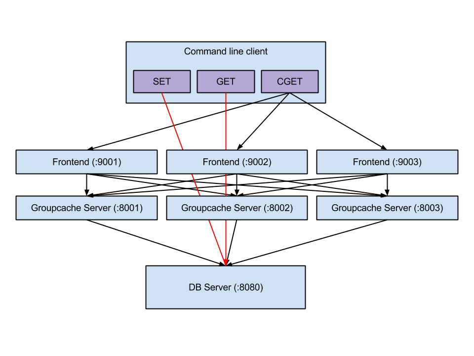
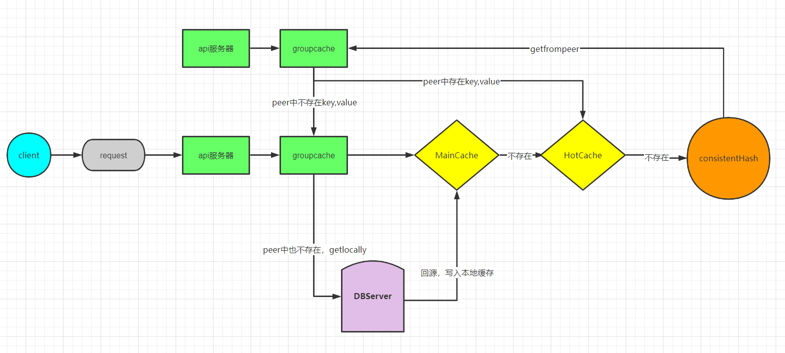

# groupcache 

## 介绍

groupcache是一个kv存储库，由memcached的作者实现。

- **特点：**没有set、update、delete接口，用户无法更新和删除缓存，不能设置过期时间，只能通过LRU淘汰最近最少访问的数据；缓存的容量通过底层的LRU管理。
- **使用场景：**某些数据如果长时间不修改，可以用groupcache作为缓存；缓存静态文件，用文件md5作为key，value就是文件。这种场景就很适合用groupcache，因为key对应的value不需要变。

**常见缓存的需要解决的问题**

1. **缓存穿透：**指查询不一定存在的数据，此时从数据源查询不到结果，因此也无法对结果进行缓存，这直接导致此类型的查询请求都会落到后端，加大后端的压力。
2. **缓存击穿：**指对于那些热点数据，在缓存失效的时候，高并发的请求会导致后端请求压力飙升。原因：
   - 比如扫描式的遍历
   - 比如缓存时间到期
   - 请求过大，不断的cache不断的淘汰导致
3. **缓存雪崩：**穿透和击穿的场景可能引发进一步的雪崩，比如大量的缓存过期时间被设置为相同或者近似，缓存批量失效，一时间所有的查询都落到后端。

## groupcache 架构设计

测试程序的架构图 https://capotej.com/blog/2013/07/28/playing-with-groupcache/

客户端和groupcache通过rpc进行通信，而groupcache peer之间通过http协议进行通信；客户端用的是set或get命令时，这时直接操作的是数据源(数据库或文件)，如果调用的是cget命令，则从groupcache中查找数据；



- API服务接收来自用户的请求（Frontend）
- 每一个API服务都有一个groupcache实例（Groupcache Server）
- groupcache 最终的数据源是 DBServer

### API 接口特点

groupcache 封装 Group 这个对象对外提供服务，这个服务只有三个极简的接口：

| 接口名     | 作用                               |
| ---------- | ---------------------------------- |
| Get        | 传入一个 key，获取 value           |
| Name       | Group 的名字，因为可以有多个 Group |
| CacheStats | 统计数据，比如命中率等             |

这三个就是完全的对外使用的 API，没有更改，删除的接口，缓存一旦写入，则永远不会变动（指的是用户）。

### client & server

groupcache 实现的库是 client 也是 server ，这个怎么理解？groupcache 实现的是一个分布式的无中心化的缓存集群。每个节点，既作为 server ，对外提供 api 访问，返回 key 的数据，节点之间，也是相互访问的，是以 C/S 模式。

### 缓存一致性

groupcache 缓存一旦设置之后，没有更新和删除接口，也没有失效时间（完全是内部根据空间淘汰缓存，对外不感知），你根本无法更新，所以自然就没有更新导致的缓存一致性问题。

**没有缓存失效时间**，那么就不存在因为时间到期，导致批量缓存失效，从而引发大量击穿相关的问题。

### 防击穿

在使用缓存的场景，有一个必须要考虑的：当出现缓存失效的时候，会不会导致突发大量的缓存击穿流量？

比如，一个 k-v 存储，客户端先看是否有 k 的缓存，如果有，那么直接给用户返回，如果没有，则向后端存储请求。 比如，突然来了1万个这样的请求，发现都是 miss，那么都去后端拉数据了，这种就可能会一下导致后端压力暴涨。其实，这种场景，只要第一个人发下去了就行了，其他的请求等着这个请求返回就好了，大家都是请求同一个值。

内部实现了 singlefilght 就是解决这个问题的，原理很简单，这里就讲一个变形实现：

```go
type call interface {
    wg sync.WaitGroup
    val interface{}
    err error
}
```

这个接口要能做这几个事情：

1. 能够存值，第一个请求回来的时候，值赋给 `val`
2. 要能够同步，第一个请求下去之后，后面的请求发现有同名 `key` 下去了，那么就地等待，这里通过 wg 来同步这个行为。第一个请求回来之后，通过 wg 来唤醒
3. 要能够存 error ，如果有错误，那么要能存起来

其次，要有个 map 结构

```go
type Group struct {
        mu sync.Mutex       
        m  map[string]*call
}
```

map 结构是用来存储 k-v 的，`key` 是用户请求 `key` ，value 是下去的请求，抽象为了 `call` 。

最后就是防止击穿的逻辑了：

1. 如果 `map` 里面有同名 `key` 已经下去了，那么就地等待，等唤醒之后，直接返回值
2. 如果 `map` 没有同名 `key` ，那么说明该这个请求亲自下去了
   1. 创建一个 `call` 对象，把自己的 key 放进去，这样别人就能感知到他已经去服务端拿数据了

```go
func (g *Group) Do(key string, fn func() (interface{}, error)) (interface{}, error) {
        g.mu.Lock()
        if g.m == nil {
                g.m = make(map[string]*call)
        }

    // 如果已经有人去拿数据了，那么等
        if c, ok := g.m[key]; ok {
                g.mu.Unlock()
                c.wg.Wait()	 // wait方法阻塞直到WaitGroup计数器减为0。
                return c.val, c.err
        }

    // 否则，自己下去
        c := new(call)
        c.wg.Add(1)
        g.m[key] = c
        g.mu.Unlock()

        c.val, c.err = fn()
        c.wg.Done()

        g.mu.Lock()
        delete(g.m, key)
        g.mu.Unlock()

        return c.val, c.err
}
```

### group 的机制

所谓 group 其实是一个命名空间的设计，不同的命名空间是相互隔离的。

```go
type Group struct {
	name       string
	getter     Getter // 获取数据接口
	peersOnce  sync.Once // 保证初始化一次peer
	peers      PeerPicker // peer获取
	cacheBytes int64 // 对缓存大小的限制接口
	mainCache cache // mainCache 是分布式中本地分配到的cache部分
	hotCache cache // hotcache是由于访问频率高而被复制到此节点的缓存,尽管本节点不是它的拥有者。
	loadGroup flightGroup // 保证key只会获取一次
	_ int32
	Stats Stats
}
```

### 协商填充

固定的 key 由固定的节点服务，这个相当于一个绑定。举个例子，A，B，C 三个节点，如果请求发给了 A，节点 A 哈希计算发现这个请求应该是 B 节点执行，那么会转给 B 执行。这样只需要 B 节点把这个请求处理好即可，**这样能防止在缓存 miss 的时候，整个系统节点的惊群效应**。

通过这种协商才能保证请求聚合发到 B，同一时间 B 收到大量相同 key 的请求，无论自己有没有，都能很好处理，因为有之前说的防击穿的措施：

- 如果 B 有，立马返回就行；
- 如果没有也只是放一个请求下去，后端压力可以很小的；

### 预热机制

这个其实是和协商填充一起达到的效果，请求实现了节点绑定，那么在分布式集群的模式下，很容易实现预热的效果，你这个请求大概率是已经被其他节点缓存了的。

### 热点数据多节点备份

分布式缓存系统中，一般需要从两个层面考虑热点均衡的问题：

1. 大量的 key 是否均衡的分布到节点；
   - 这个指请求数量的分布均衡
2. 某些 key 的访问频率也是有热点的，也是不均衡的；

针对第一点，不同节点会负责特定的 key 集合的查询请求，一般来讲只要哈希算法还行， key 的分布是均衡的，但是针对第二点，如果某些 key 属于热点数据而被大量访问，这很会导致压力全都在某个节点上。

groupcache 有一个热点数据自动扩展机制用来解决这个问题，针对每个节点，除了会缓存本节点存在且大量访问的 key 之外，也会缓存那些不属于节点的（但是被频繁访问）的 key，缓存这些 key 的对象被称为 hotcache。

**协商机制和多节点备份**这两个特性是 groupcache 的杀手级特性。

## 流程分析

### Get读取数据

当客户端连上groupcache时，能做的只有get获取数据，如果本地有所需要的数据，则直接返回，如果没有，则通过一致性哈希函数判断这个key所对应的peer，然后通过http从这个peer上获取数据；如果这个peer上有需要的数据，则通过http回复给之前的那个groupcache；groupcache收到之后，保存在本地hotCache中，并返回给客户端；如果peer上也没有所需要的数据，则groupcache从数据源(数据库或者文件)获取数据，并将数据保存在本地mainCache，并返回给客户端；



Get函数很简单，先检查本地cache是否存在，存在即返回，不存在则向peer获取。

```go
func (g *Group) Get(ctx context.Context, key string, dest Sink) error {
	g.peersOnce.Do(g.initPeers)
	g.Stats.Gets.Add(1)
	if dest == nil {
		return errors.New("groupcache: nil dest Sink")
	}
	value, cacheHit := g.lookupCache(key)

	if cacheHit {
		g.Stats.CacheHits.Add(1)
		return setSinkView(dest, value)
	}
	destPopulated := false
	value, destPopulated, err := g.load(ctx, key, dest)
	if err != nil {
		return err
	}
	if destPopulated {
		return nil
	}
	return setSinkView(dest, value)
}

func (g *Group) lookupCache(key string) (value ByteView, ok bool) {
	if g.cacheBytes <= 0 {
		return
	}
	value, ok = g.mainCache.get(key)
	if ok {
		return
	}
	value, ok = g.hotCache.get(key)
	return
}
```

load函数先是从peer获取数据，如果peer没有数据，则直接从数据源(数据库或文件)获取数据；

```go

func (g *Group) load(ctx context.Context, key string, dest Sink) (value ByteView, destPopulated bool, err error) {
	g.Stats.Loads.Add(1)
	viewi, err := g.loadGroup.Do(key, func() (interface{}, error) {
		if value, cacheHit := g.lookupCache(key); cacheHit {
			g.Stats.CacheHits.Add(1)
			return value, nil
		}
		g.Stats.LoadsDeduped.Add(1)
		var value ByteView
		var err error
		if peer, ok := g.peers.PickPeer(key); ok {
			value, err = g.getFromPeer(ctx, peer, key)
			if err == nil {
				g.Stats.PeerLoads.Add(1)
				return value, nil
			}
			g.Stats.PeerErrors.Add(1)
			// TODO(bradfitz): log the peer's error? keep
			// log of the past few for /groupcachez?  It's
			// probably boring (normal task movement), so not
			// worth logging I imagine.
		}
		value, err = g.getLocally(ctx, key, dest)
		if err != nil {
			g.Stats.LocalLoadErrs.Add(1)
			return nil, err
		}
		g.Stats.LocalLoads.Add(1)
		destPopulated = true // only one caller of load gets this return value
		g.populateCache(key, value, &g.mainCache)
		return value, nil
	})
	if err == nil {
		value = viewi.(ByteView)
	}
	return
}
```

getLocallly函数主要是利用NewGroup创建Group时传进去的Getter，在调用这个Getter的Get函数从数据源获取数据。当本地groupcache中不存在数据时，会先从peer处获取数据。

```go
func (g *Group) getLocally(ctx context.Context, key string, dest Sink) (ByteView, error) {
	err := g.getter.Get(ctx, key, dest)
	if err != nil {
		return ByteView{}, err
	}
	return dest.view()
}

func (g *Group) getFromPeer(ctx context.Context, peer ProtoGetter, key string) (ByteView, error) {
	req := &pb.GetRequest{
		Group: &g.name,
		Key:   &key,
	}
	res := &pb.GetResponse{}
	err := peer.Get(ctx, req, res)
	if err != nil {
		return ByteView{}, err
	}
	value := ByteView{b: res.Value}
	if rand.Intn(10) == 0 {
		g.populateCache(key, value, &g.hotCache)
	}
	return value, nil
}
```

